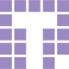

# Obsidian UI

## Welcome

Obsidian UI is a collection of useful iOS user interface components and utilities for use in a wide range of projects.  For convenience, the classes have been bundled into one framework, ready to be dropped into your app.

## Installation

Obsidian UI is available on CocoaPods.
Add the following to your `Podfile`:

```
pod 'Obsidian-UI-iOS'
```

Then add the following to import:

```
import Obsidian_UI_iOS 
```

## Documentation

See the [documentation](http://cocoadocs.org/docsets/Obsidian-UI-iOS) at CocoaDocs.

## Getting Help

Please direct all bugs, feature requests, and other concerns to Nick Lee, <nick@tendigi.com>

## License

Obsidian UI is released under the MIT license. See LICENSE for details.

## Examples

You can check for valid input in a text field. Below the field checks for any input at all (length > 0). The label's
border is set to green once it is considered valid.

	class ViewController: UIViewController, InputTextFieldValidityDelegate {

     var field = InputTextField()
    
     override func viewDidLoad() {
         super.viewDidLoad()
        
         field.setValidChecker { (input) -> Bool in
             return input.length > 0
         }
      }

     func inputDidBecomeValid(field: InputTextField) {
           print("valid")
           field.layer.borderColor = UIColor.greenColor().CGColor
           field.layer.borderWidth = 1
      }
    
      func inputDidBecomeInvalid(field: InputTextField) {
          print("invalid")
          field.layer.borderWidth = 0
      }

	}

Add a label with a top, middle, or bottom vertical alignment.

	var label = VerticallyAlignedLabel()
	label.verticalAlignment = .Top

Quickly setup a view with a nib. 

	class View: NibView {
    
    	@IBOutlet weak var button: UIButton!
    
    	override var nibName: String {
        	return "ViewNibName"
    	}
    
    	override func configure() {
        	super.configure()
        	button.backgroundColor = UIColor.blueColor()
    	}

	}

Setup a camera in a few lines.

    let camera = Camera()

    override func viewDidLoad() {
        super.viewDidLoad()
        
        camera.previewLayer?.frame = view.bounds
        view.layer.addSublayer(camera.previewLayer!)
        
    }
    
    func buttonTapped() {
        camera.captureImage()
    }

